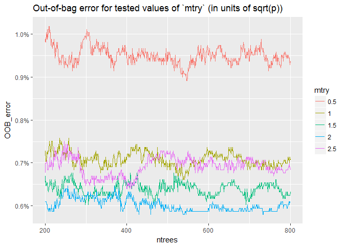

# Machine Learning: Human Activity Performance Evaluation
Paul Clark  
April 29, 2017  


# Introduction

### Background

Using wearable devices like Fitbit, much data on personal activity can be collected cheaply. The goal of this exercise is to use data from motion sensors on the belt, forearm, arm, and dumbbell of 6 participants to recognize the manner in which they performed dumbbell lifts: i.e., whether they did a specific lift correctly (`classe` "A"), or in one of 4 specified incorrect ways (`classe` "B" through "E"). More information and data was available here as of 4/18/17: <http://groupware.les.inf.puc-rio.br/har>. See the section _"Weight Lifting Exercise Dataset"_ [@Velloso2013].  Note that all information drawn from the original study is licensed under Creative Commons (CC BY-SA): it can be used for any purpose as long as the original authors are cited.

### Main Objectives
  
  *  Build a model to recognize, based on sensor data from the original study, the manner ("`classe`") in which each of the 6 participants represented in the training and test data did a specific barbell lift on any given occasion.  Below, we refer to this as the case of "in-sample" participants.
  * In particular, predict the values (A through E) of 20 unlabeled observations in a testing dataset.

### Report

This report describes key steps in the analysis, including rationale for key choices.  Featured elements include:

  * Model building
  * Model validation strategy
  * Expected out-of-sample error

### Key Conclusions

A random forest model based on the data sampled at 45 Hz provides high prediction accuracy on "held out" observations of subjects who participate in model training (~ 99%), but relatively low accuracy on completely new participants (~ 37%).

# Preparation

### Data Retrieval

Data was obtained via the links below on 4/16/17. We load it using package `readr`.  

```r
if (!file.exists("training.csv")){
        download.file("https://d396qusza40orc.cloudfront.net/predmachlearn/pml-training.csv", "training.csv")
}
if (!file.exists("testing.csv")){
        download.file("https://d396qusza40orc.cloudfront.net/predmachlearn/pml-testing.csv", "testing.csv")
}
if (!"readr" %in% rownames(installed.packages())) install.packages("readr")
library(readr)

colspec<-list(user_name = col_factor(levels = c("adelmo","carlitos","charles","eurico","jeremy","pedro")), 
                classe = col_factor(levels = c("A","B","C","D","E")))

# guess_max set at 6000 to capture decimal values first occurring after row 1000
training <- read_csv("training.csv", na = c("","NA","#DIV/0!"), col_types = colspec, guess_max = 6000)
testing <- read_csv("testing.csv", na = c("","NA","#DIV/0!"), col_types = colspec)
```
### Data Pre-Processing

Summary of the data via `str()` is omitted here due to length. The training data has 159 predictors and 19622 observations before pre-processing.

```r
str(training, list.len = ncol(training), give.attr = FALSE)
str(testing, list.len = ncol(testing), give.attr = FALSE)
```
In the original analysis, raw sensor signals were sampled at 45 Hz over windows of time from 0.5 to 2.5 seconds. Summary "features" (variable names in the dataset beginning with "`avg_`", "`stddev_`", "`kurtosis_`", "`skewness_`", etc.) were computed in post-processing of signals over each window. Both summary features and 45 Hz signals are provided in the training data, but the summary features are not provided in the test data.  Therefore, the summary features are not useful for prediction on the test set and are excluded from the modelling. Additionally, no rows with `new_window == 'yes'`, which contain the summary features, appear in the test set, so these are also excluded. Finally, in the absence of contextual documentation, we see no way to make use of the "`_timestamp_`" or "`_window`" information in predicting test labels, therefore we exclude it, too.  We use package `dplyr` to omit the undesired variables.

```r
if (!"dplyr" %in% rownames(installed.packages())) install.packages("dplyr"); library(dplyr)

training <- filter(training,new_window!="yes")%>%select(-c(X1,raw_timestamp_part_1:num_window,starts_with(
        "avg"),starts_with("stddev"),starts_with("kurt"),starts_with("skew"),starts_with("max"),starts_with(
        "min"),starts_with("amplitude"),starts_with("var")))

testing<-select(testing,-c(X1,raw_timestamp_part_1:num_window,starts_with("avg"),starts_with("stddev"),
        starts_with("kurt"),starts_with("skew"),starts_with("max"),starts_with("min"),starts_with("amplitude"),
        starts_with("var")))
```

After the exclusions, we are left with 53  potential predictors.  

```r
names(training)[-length(training)]
```

```
##  [1] "user_name"            "roll_belt"            "pitch_belt"           "yaw_belt"            
##  [5] "total_accel_belt"     "gyros_belt_x"         "gyros_belt_y"         "gyros_belt_z"        
##  [9] "accel_belt_x"         "accel_belt_y"         "accel_belt_z"         "magnet_belt_x"       
## [13] "magnet_belt_y"        "magnet_belt_z"        "roll_arm"             "pitch_arm"           
## [17] "yaw_arm"              "total_accel_arm"      "gyros_arm_x"          "gyros_arm_y"         
## [21] "gyros_arm_z"          "accel_arm_x"          "accel_arm_y"          "accel_arm_z"         
## [25] "magnet_arm_x"         "magnet_arm_y"         "magnet_arm_z"         "roll_dumbbell"       
## [29] "pitch_dumbbell"       "yaw_dumbbell"         "total_accel_dumbbell" "gyros_dumbbell_x"    
## [33] "gyros_dumbbell_y"     "gyros_dumbbell_z"     "accel_dumbbell_x"     "accel_dumbbell_y"    
## [37] "accel_dumbbell_z"     "magnet_dumbbell_x"    "magnet_dumbbell_y"    "magnet_dumbbell_z"   
## [41] "roll_forearm"         "pitch_forearm"        "yaw_forearm"          "total_accel_forearm" 
## [45] "gyros_forearm_x"      "gyros_forearm_y"      "gyros_forearm_z"      "accel_forearm_x"     
## [49] "accel_forearm_y"      "accel_forearm_z"      "magnet_forearm_x"     "magnet_forearm_y"    
## [53] "magnet_forearm_z"
```

# Model Tuning and Validation Strategy

Based on the training data, we create a `Validation` partition and a `Train` participation. The purpose of the `Train` partition is to teach the model to predict. The purpose of the `Validation` participation is to estimate performance of the model when applied to new data.  In work below, we also make use of another source of data, the "out-of-bag" ("OOB") data in random forest models.  These are subsets of the `Train` data that are not used to build any given tree: they are 'left out' of the bootstrap sample for building that tree, and can be used to assess model generalization performance.  Studies have shown that there is a systematic pessimistic bias to this method, but that 10-fold cross-validation is similarly biased, and the bias in both cases is small [@Bylander2002].

In this study, our strategy for use of these three data sources differs between modeling for "in-sample" vs. "out-of-sample" participant activity recognition. For the case of in-sample participants, we use the `Train` partition to train the model, the *out-of-bag* data to tune its main hyperparameter, `mtry`, and the `Validation` partition to assess accuracy.  For the case of out-of-sample participants, we split the `Train` data into 6 folds (one per participant), and perform "leave-one-participant-out" cross-validation.  To avoid any overfitting from hyperparameter selection, we do _**no**_ model tuning in the out-of-sample case: the `randomForest` model is used with its default parameters.

For assessment of the in-sample participant predictions, the `caret` package produces a partition stratified with respect to the 5 `classe` outcomes.  Note that `caret` requires the `lattice` and `ggplot2` packages, by default.

```r
if (!"caret" %in% rownames(installed.packages())) install.packages("caret")
if (!"lattice" %in% rownames(installed.packages())) install.packages("lattice")
if (!"ggplot2" %in% rownames(installed.packages())) install.packages("ggplot2")
library(caret)
set.seed(1)
inTrain <- createDataPartition(y = training$classe, p = 0.7, list = FALSE)
Train <- training[inTrain,]
Validation <- training[-inTrain,]
```
  
  
# Model Building and Testing
  
### Prediction for "in-sample" participants

Following the authors of the original paper, we predict based on random forests.  Minimum `nodesize` is set to 10 to keep computation times manageable (the default is 1), and to provide potential performance enhancement  (see @elements, page 598, for a regression example). Below, to optimize accuracy of the model, we loop over different values of `mtry` (the number of variables randomly chosen to evaluate any given split in a tree), examining out-of-bag error for each value, and picking the highest performing value.

```r
if (!"randomForest" %in% rownames(installed.packages())) install.packages("randomForest")
library(randomForest)
mtry_mult <- c(0.5,1,1.5,2,2.5)
p <- length(Train[,-length(Train)]) # Not counting response variable `classe`
mtry_vec <- floor(mtry_mult*sqrt(p))
ntree. = 800
rfModl <- vector("list",length(mtry_mult))
OOBvTrees <- data.frame(mtry = NULL, ntrees = NULL,OOB_error = NULL)

for (i in 1:length(mtry_vec)) {
        set.seed(921)
        rfModl[[i]] <- randomForest(x=Train[,-length(Train)],y =Train$classe,prox=FALSE,do.trace=FALSE,
                                nodesize=10, importance = FALSE, ntree = ntree., mtry = mtry_vec[i])
        temp <- data.frame(mtry = rep(as.character(mtry_mult[i]),ntree.), ntrees = 1:ntree., 
                          OOB_error = rfModl[[i]]$err.rate[,1])
        OOBvTrees <- rbind(OOBvTrees, temp)
}
```
We plot the OOB error as a function of number of trees for the different tested values of `mtry`, finding that `mtry` of 2 times `sqrt(number of predictors)` (`mtry = `14, after rounding down to the nearest integer) provides the lowest *OOB* error, and that the error rate appears to stabilize by 800 trees. In contrast, `mtry` of 0.5 times `sqrt(p)` (`mtry = `3) is clearly sub-optimal: model bias is too high, presumably due to infrequent access to the most relevant variables (@elements, page 600).

```r
g <- ggplot(data = OOBvTrees[OOBvTrees$ntrees > 199,],aes(x=ntrees,y=OOB_error, color=mtry)) +
        geom_line() + scale_y_continuous(labels = scales::percent) +
        labs(title = "Out-of-bag error for tested values of `mtry` (in units of sqrt(p))")
print(g)
```

<!-- -->

We next compute the confusion matrix and associated statistics on the validation dataset.  Performance appears quite good. Note that we find it necessary to reference `predict` by its package name: it doesn't appear to be directly available in the namespace, at least with the current collection of packages loaded.


```r
rfPred <- randomForest:::predict.randomForest(rfModl[[4]], newdata = Validation[,-length(Train)], type = "response")
rfConf <- confusionMatrix(rfPred, Validation$classe)
rfConf
```

```
## Confusion Matrix and Statistics
## 
##           Reference
## Prediction    A    B    C    D    E
##          A 1639   10    0    0    0
##          B    2 1103    7    0    0
##          C    0    2  997   12    1
##          D    0    0    1  932    7
##          E    0    0    0    0 1050
## 
## Overall Statistics
##                                           
##                Accuracy : 0.9927          
##                  95% CI : (0.9902, 0.9947)
##     No Information Rate : 0.2847          
##     P-Value [Acc > NIR] : < 2.2e-16       
##                                           
##                   Kappa : 0.9908          
##  Mcnemar's Test P-Value : NA              
## 
## Statistics by Class:
## 
##                      Class: A Class: B Class: C Class: D Class: E
## Sensitivity            0.9988   0.9892   0.9920   0.9873   0.9924
## Specificity            0.9976   0.9981   0.9968   0.9983   1.0000
## Pos Pred Value         0.9939   0.9919   0.9852   0.9915   1.0000
## Neg Pred Value         0.9995   0.9974   0.9983   0.9975   0.9983
## Prevalence             0.2847   0.1935   0.1744   0.1638   0.1836
## Detection Rate         0.2844   0.1914   0.1730   0.1617   0.1822
## Detection Prevalence   0.2861   0.1930   0.1756   0.1631   0.1822
## Balanced Accuracy      0.9982   0.9937   0.9944   0.9928   0.9962
```

Finally, we compute the predicted values for the unlabeled testing data. These are kept hidden since they are answers to a graded assignment.

```r
randomForest:::predict.randomForest(rfModl[[4]], newdata = testing, type = "response")
```

#### Out-of-sample error for "in-sample" participants

Based on the above, we expect an out-of-sample error rate of **0.73%**.  Note that this error rate is slightly higher than the 'out-of-bag' estimate of **0.61%** from model validation on OOB observations.  This may be a statistical fluctuation: the difference is inside the 95% confidence interval provided in the confusion matrix results.

### Prediction for "out-of-sample" participants

Before closing, we use cross-validation to investigate the model's accuracy on participants for which there is no training data.  Performance is rather poor (~ 37% accuracy): the model fails to generalize to unknown participants. This seems a major limitation of this approach.  We could try to 'tune' some of the parameters to improve performance (in particular, `mtry`) but this would probably only generate marginal improvements with inordinately long compute-times.  Note that the original authors achieve accuracies on order ~ 75%, but they use the processed data we have discarded, not the raw signals we use to predict the assignment test data.

```r
parts <- c("adelmo","carlitos","charles","eurico","jeremy","pedro")

rfPredLOPO_Tot <- NULL
partTest_Tot <- NULL
set.seed(309)
for (i in 1:length(parts)){
        partTest <- filter(training, user_name==parts[i]) %>% select(-user_name)
        partTrain <- filter(training, user_name!=parts[i]) %>% select(-user_name)
        rfModLOO<-randomForest(x=select(partTrain,-classe),y=partTrain$classe,prox=FALSE,
                               nodesize=10,do.trace= 25)
        rfPredLOPO <- randomForest:::predict.randomForest(rfModLOO, newdata=partTest, type = "response")
        partTest_Tot <- rbind(partTest_Tot, partTest)
        rfPredLOPO_Tot <- c(rfPredLOPO_Tot,rfPredLOPO)
}

# Convert classe labels back to A to E factors: they become 1 to 5 during concatenation in `for` loop
classelabels = c("A","B","C","D","E")
rfPredLOPO_Tot <- factor(classelabels[rfPredLOPO_Tot], levels = classelabels)
```
  

We show the confusion matrix and statistics for leave-one-participant-out cross-validation:

```r
(rfLOPOConf <- confusionMatrix(rfPredLOPO_Tot,partTest_Tot$classe))
```

```
## Confusion Matrix and Statistics
## 
##           Reference
## Prediction    A    B    C    D    E
##          A 2494  576  628  679   99
##          B  483 1493  839 1028  543
##          C    0   21  271   12   15
##          D    2   38  138  124  163
##          E 2492 1590 1476 1304 2708
## 
## Overall Statistics
##                                           
##                Accuracy : 0.369           
##                  95% CI : (0.3621, 0.3758)
##     No Information Rate : 0.2847          
##     P-Value [Acc > NIR] : < 2.2e-16       
##                                           
##                   Kappa : 0.2025          
##  Mcnemar's Test P-Value : < 2.2e-16       
## 
## Statistics by Class:
## 
##                      Class: A Class: B Class: C Class: D Class: E
## Sensitivity            0.4559   0.4016  0.08085 0.039403   0.7676
## Specificity            0.8558   0.8133  0.99697 0.978779   0.5626
## Pos Pred Value         0.5572   0.3404  0.84953 0.266667   0.2830
## Neg Pred Value         0.7980   0.8500  0.83696 0.838782   0.9150
## Prevalence             0.2847   0.1935  0.17444 0.163770   0.1836
## Detection Rate         0.1298   0.0777  0.01410 0.006453   0.1409
## Detection Prevalence   0.2329   0.2282  0.01660 0.024199   0.4980
## Balanced Accuracy      0.6558   0.6074  0.53891 0.509091   0.6651
```


# Discussion

### Summary  

The methods above provide high recognition performance for "in-sample" participants (overall error rate of **0.73%**).  However, a training period per participant is required.  

With overall error rate of **63.1%**, the model does not generalize well to "out-of-sample" participants.  The error on out-of-sample participants is not that much lower than the error of ~ **72%**, obtained by always guessing (A), the most common value for `classe`.  

### Avenues for future investigation

There are a number of potential strategies for improving prediction accuracy for out-of-sample participants.  These include: 

  *  Tuning the parameter `mtry` (the number of variables evaluated for each split in the trees), as in the "in-sample" participant case
  *  Tuning the parameter `nodesize`, the minimum number of observations allowed per terminal node (see @elements, page 598)
  *  Basing prediction on the computed summary features used by the original authors but not used in the test data for this assignment
  *  Trying another learning algorithm such as tree-based boosting: it may enable superior performance in certain cases, such as when there are many irrelevant variables (@elements, page 597)


# Bibliography
  
  
